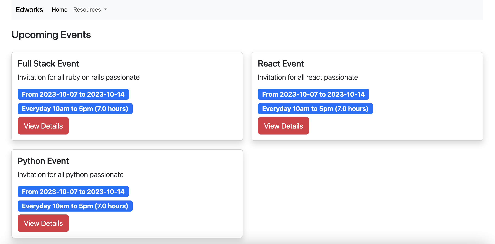

<h1>Workshop Rails App</h1>

 

<!-- TABLE OF CONTENTS -->

# 📗 Table of Contents

- [📖 About the Project](#about-project)
  - [🛠 Built With](#built-with)
    - [Tech Stack](#tech-stack)
    - [Key Features](#key-features)
  - [🚀 Live Demo](#live-demo)
- [💻 Getting Started](#getting-started)
  - [Setup](#setup)
  - [Prerequisites](#prerequisites)
  - [Install](#install)
  - [Usage](#usage)
  - [Run tests](#run-tests)
  - [Deployment](#triangular_flag_on_post-deployment)
- [👥 Authors](#authors)
- [🔭 Future Features](#future-features)
- [🤝 Contributing](#contributing)
- [⭐️ Show your support](#support)
- [🙏 Acknowledgements](#acknowledgements)
- [❓ FAQ](#faq)
- [📝 License](#license)

<!-- PROJECT DESCRIPTION -->

# 📖 Workshop Rails App 

** Workshop rails app is a platform that allows users to purchase and request partial or total refund for the purchase through Stripe. **

## 🛠 Built With 

### Tech Stack 

 

  
This app was built with Rails.

  <ul>
    <li><a href="https://reactjs.org/">Ruby</a></li>
    <li><a href="https://reactjs.org/">Rails</a></li>
    <li><a href="https://reactjs.org/">Bootsrap</a></li>
    <li><a href="https://reactjs.org/">Stripe</a></li>
  </ul>

<!-- Features -->

### Key Features 

- **Stripe integration for purchases and partial or complete refund**
- **Separates past events from future events**
- **Has admin dashboard with permissions settings**

(<a href="#readme-top">back to top</a>)

<!-- LIVE DEMO -->

## 🚀 Live Demo 

- [Pending deployment](https://pending-deployment.com/)

(<a href="#readme-top">back to top</a>)

<!-- GETTING STARTED -->

## 💻 Getting Started 

To get the content of this project locally you need to run the following commands in your terminal:

and follow these steps.

### Prerequisites

- IDE(code editor) like: **Vscode**, **Sublime**, etc.
- [Git](https://www.linode.com/docs/guides/how-to-install-git-on-linux-mac-and-windows/)

### Setup

Clone this repository to your desired folder:

1. Download the **Zip** file or clone the repo with:
   `bash git clone git@github.com:gjuliao/workshop.git`
2. To access cloned directory run:
   `bash cd workshop`
3. Open it with the live server

### Install

> To install linters and other project's dependencies run:
> `bundle install `

### Usage

To run the project, execute the following command:

### Run tests

To run tests, run the following command:

Test for Linters For tracking linter errors locally you need to follow these steps:

1. For tracking linter errors in HTML files run:
   `bash npx hint . `
2. For tracking linter errors in CSS or SASS files run:
   `bash npx stylelint "**/*.{css,scss}" `
3. For tracking linter errors in javascript files run:
   `bash npx eslint . `

### Deployment

You can deploy this project using:

(<a href="#readme-top">back to top</a>)

<!-- AUTHORS -->

## 👥 Authors 
👤 **Giovanni Juliao**

- GitHub: [@gjuliao](https://github.com/gjuliao)

(<a href="#readme-top">back to top</a>)

<!-- FUTURE FEATURES -->

## 🔭 Future Features 

- [ ] **[Add more styles to show section]**
- [ ] **[Add more features to event]**
- [ ] **[Allow more crud operations to users & admin]**

(<a href="#readme-top">back to top</a>)

<!-- CONTRIBUTING -->

## 🤝 Contributing 

Contributions, issues, and feature requests are welcome!

Feel free to check the [issues page]([../../issues/](https://github.com/gjuliao/workshop/issues)).

(<a href="#readme-top">back to top</a>)

<!-- SUPPORT -->

## ⭐️ Show your support 

> Write a message to encourage readers to support your project

If you like this project please give us a star!

(<a href="#readme-top">back to top</a>)

<!-- ACKNOWLEDGEMENTS -->

## 🙏 Acknowledgments 

> Give credit to everyone who inspired your codebase.

I would like to thank to the rails team for making amazing programming language.

(<a href="#readme-top">back to top</a>)

<!-- LICENSE -->

## 📝 License 

This project is [MIT](./MIT.md) licensed.

(<a href="#readme-top">back to top</a>)

